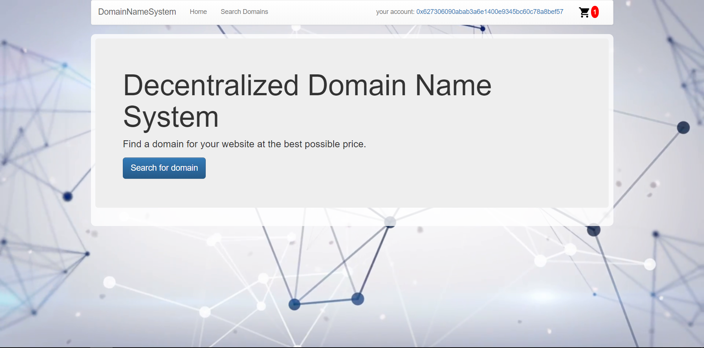
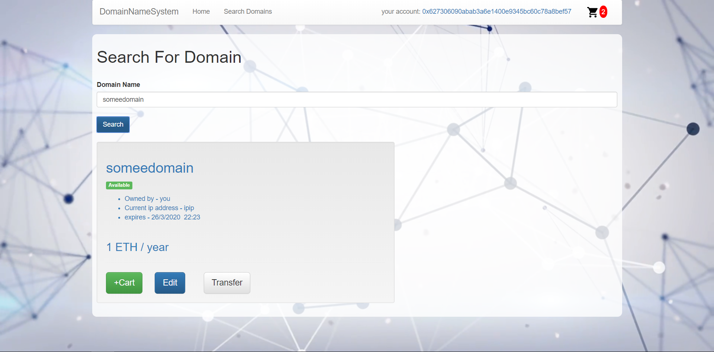
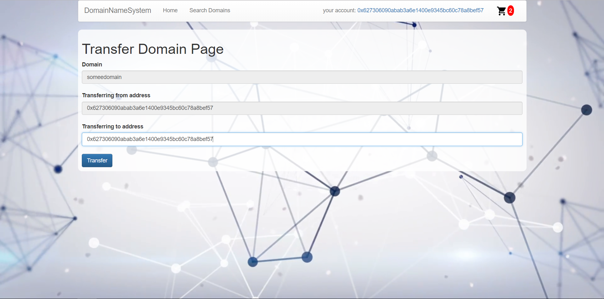
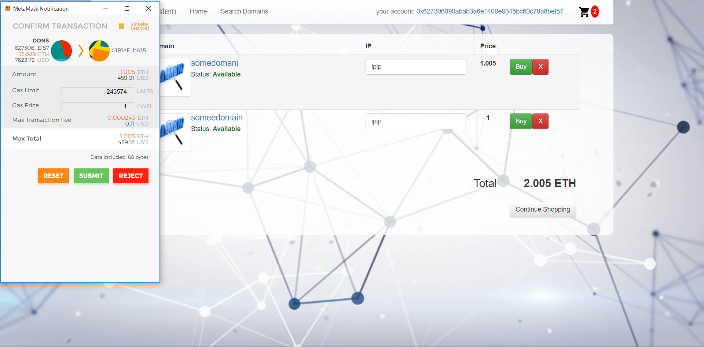

# Contract Address at Rinkeby network 
0x259d80fca05d945614f49da3d56f98ed664d8192

# Decentralized Domain Name System
Course Project for the "Smart contract development with solidity" course

DDNS is a project that uses ethereum blockchain to provide a decentralized purchase and ownership claiming for domain names. The project consists
of a smart contract to hold the logic and information about domains and their owner and a React.js web application that provides a user
interaction with the contract (using web3 and Metamask). 

# Application Screenshots
  - Home Page
    
  - Searching Domain
    
  - Transfer Domain
    
  - Shopping Cart
     